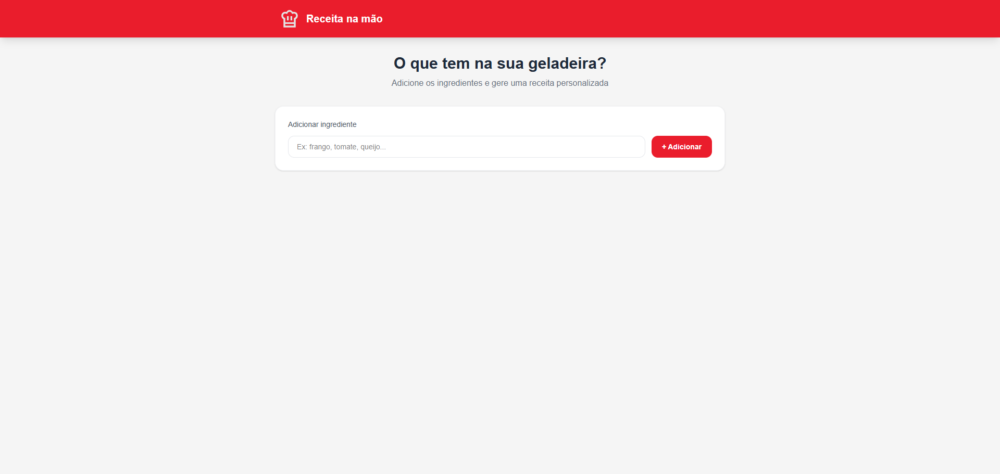
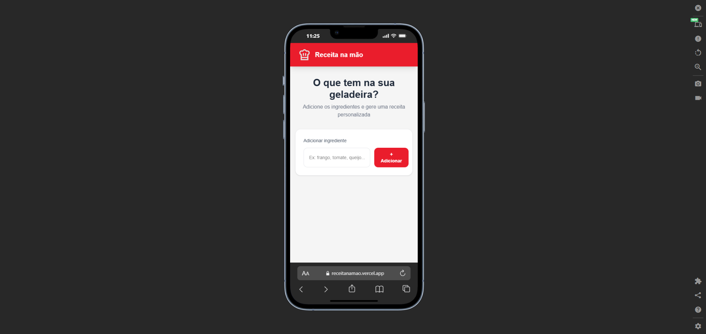

# Receita na Mão
AI-powered recipe generator built with React, Vite, TailwindCSS and HuggingFace Inference API.

This project was created to practice React fundamentals, API integration with AI models, and modern UI design using a component-based architecture.

## Live Demo
[Open App](https://receitanamao.vercel.app/)

## Preview




## Technologies
- React 19
- Vite 8
- TailwindCSS 4
- HuggingFace Inference API
- Mistral 7B Instruct (via featherless-ai provider)
- react-markdown

## Features
- Add ingredients from your fridge or pantry
- Visual ingredient tags
- AI-generated recipe based on available ingredients
- Formatted recipe output (title, ingredients list, step-by-step instructions, chef tip)
- Loading state feedback during generation
- iFood-inspired red UI design
- Serverless API route (Vercel-compatible)

## Objective
The goal of this project was to build a practical AI-powered application using React and external LLM APIs, with focus on clean component architecture and modern UI.

Main concepts practiced:

- React state management with hooks
- Form handling with React 19 action API
- Fetch API and async/await
- Vite dev server middleware
- Environment variables with loadEnv
- Markdown rendering with react-markdown
- TailwindCSS utility-first styling

## What I Learned
During this project I practiced and improved:

- Integrating third-party AI APIs (HuggingFace Inference)
- Structuring prompts for consistent LLM output
- Handling serverless API routes with Vite middleware
- Rendering dynamic markdown content in React
- Building component-based UIs with TailwindCSS
- Managing loading and error states in async flows
- Debugging API provider compatibility issues

## Future Improvements
- Allow removing individual ingredients from the list
- Save favorite recipes to localStorage
- Add recipe categories or cuisine filters
- Support image generation for the recipe
- Add share recipe functionality
- Improve mobile layout
- Add animations for recipe reveal

## Run Locally
Clone the project:

```bash
git clone https://github.com/Edmon-Nascimento/receita-na-mao
```

Install dependencies:

```bash
npm install
```

Create a `.env.local` file with your HuggingFace token:

```
HF_API_KEY=hf_your_token_here
```

Start the dev server:

```bash
npm run dev
```

> Get your free HuggingFace token at [huggingface.co/settings/tokens](https://huggingface.co/settings/tokens)

## Author
GitHub: https://github.com/Edmon-Nascimento

LinkedIn: https://www.linkedin.com/in/edmon-nascimento/

## Notes
This project was built as a personal practice project to explore AI integration in React applications, combining LLM inference with a modern and responsive UI.
